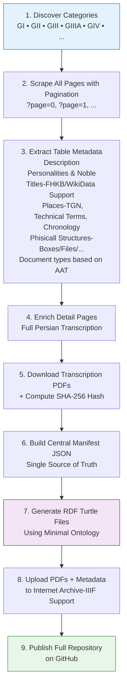

# Ghani Persian Cultural Heritage Knowledge Graph

**An Open Linked Data Edition of the Ghassem Ghani Collection (MS 235) at Yale University**

  


### Preface

The **Ghassem Ghani Collection** is one of the richest archives of Qajar-era Persian documents, containing over 1,000 handwritten and typed materials spanning political, social, economic, and cultural life in 19th- and early 20th-century Iran. Held at Yale University’s Manuscripts and Archives (Sterling Memorial Library), the collection includes royal correspondence, official reports, private letters, petitions from ordinary citizens, and important historical documents related to the Constitutional Revolution, reformist movements, and key personalities of the period.

[The original online repository at Yale](https://ghani.macmillan.yale.edu/) suffers from a dramatically poor digital design: no API, no bulk export, rudimentary search, and metadata locked in static HTML tables. This project transforms that inaccessible resource into a clean, open, machine-readable, and fully linked knowledge graph preserving every relation between documents, people, places, technical terms, chronology, transcriptions, and PDFs.
  
This repository serves as a **standalone public mirror** and the foundation for an iteratively extensible Persian Digital Cultural Heritage Knowledge Graph.

### Project Goals

- Create a complete, high-fidelity open mirror with **100% preserved relations** between all metadata, transcriptions, and PDFs.
- Build a minimal yet extensible RDF/Linked Data model suitable for cultural heritage.
- Provide permanent, citable access via GitHub and Internet Archive.
- Enable reuse by researchers, digital humanists, historians, and AI applications focused on Persian heritage.
- Follow an iterative development approach: start minimal, extend gradually.

### Pipeline Overview



### Analyzing the current status at Original repository

- Data Extraction Pipeline (802 documents scraped)
  - 7 category series (GI, GII, GIII, GIIIA, GV, GVII, GIX)
  - Full metadata extraction: descriptions, personalities, places, technical terms, chronology
  - PDF downloads with SHA-256 hashing for integrity
  - Persian transcriptions fully captured

- RDF Knowledge Graph (ghani-full.ttl)
  - 801 documents converted to RDF triples
  - 681 unique personalities (controlled vocabulary)
  - 287 unique places
  - 944 technical terms
  - Time intervals using W3C Time Ontology
  - IIIF manifest placeholders


- Custom Ontology (ghani_collection_ontology.ttl)
  - Built on CIDOC-CRM compatible foundation
  - Uses Schema.org, FOAF, SKOS, W3C Time
  - FHKB integration hooks for genealogy
  - Reconciliation properties for Wikidata, Getty TGN/AAT
  - Classes: mdhn:Document, mdhn:Personality, mdhn:Place, mdhn:TechnicalTerm, mdhn:Stamp
  - Integrating with [IIIFDexir](https://github.com/MehranDHN/IIIFCollection) 

### Repository Structure   


```
ghani-persian-kg/
├── README.md
├── LICENSE
├── scripts/
│   ├── p1Cataloge.py          # Full scraper with pagination & error handling
│   └── rdf_generator.py       # Converts manifest → RDF (coming soon)
├── data/
│   ├── raw/
│   │   ├── ghani_collection_manifest.json
│   │   └── failed_or_skipped.json
│   └── rdf/                   # Generated .ttl files
├── pdfs/                      # Local PDF copies (optional via Git LFS)
├── vocab/
│   └── ghani.ttl              # Minimal custom ontology
└── docs/
    └── process.md             # Detailed technical notes (optional)


```

## Example SPARQL Queries

The complete graph is available as a single file:  
[`data/rdf/ghani-full.ttl`](data/rdf/ghani-full.ttl) (16,350+ triples).

You can load it into any SPARQL endpoint (Fuseki, Oxigraph, Stardog, or even online tools like [yasgui.org](https://yasgui.org)).

**PREFIX declarations** (use these in every query):

```sparql
PREFIX mdhn:   <https://github.com/MehranDHN/ghani-persian-kg/vocab#>
PREFIX rdf:    <http://www.w3.org/1999/02/22-rdf-syntax-ns#>
PREFIX rdfs:   <http://www.w3.org/2000/01/rdf-schema#>
PREFIX time:   <http://www.w3.org/2006/time#>
PREFIX skos:   <http://www.w3.org/2004/02/skos/core#>
```

### 1. List the first 50 documents with their ID, category and description
```sparql
PREFIX rdfs: <http://www.w3.org/2000/01/rdf-schema#>
PREFIX mdhn: <https://github.com/mehrandhn/ghani-persian-kg/>
SELECT ?id ?category ?desc
WHERE {
  ?doc a mdhn:DigitalResource ;
       mdhn:documentId ?id ;
       mdhn:belongsToCategory ?category ;
       rdfs:comment ?desc .
}
LIMIT 50
```

### 2- Find a specific document by Ghani ID
```sparql
PREFIX mdhn: <https://github.com/mehrandhn/ghani-persian-kg/>
SELECT ?description ?transcription ?yaleURL
WHERE {
  ?doc a mdhn:DigitalResource ;
       mdhn:documentId "GI 49" ;
       mdhn:description ?description ;
       mdhn:transcription ?transcription ;
       mdhn:originalYaleURL ?yaleURL .
}
```

### 3- All documents mentioning a specific personality
```sparql
PREFIX person: <https://github.com/mehrandhn/ghani-persian-kg/person/>
PREFIX rdfs: <http://www.w3.org/2000/01/rdf-schema#>
PREFIX mdhn: <https://github.com/mehrandhn/ghani-persian-kg/>
SELECT ?id ?description ?personLabel
WHERE {
  ?doc a mdhn:DigitalResource ;
       mdhn:documentId ?id ;
       mdhn:mentionsPersonality ?person ;
       mdhn:description ?description .
  ?person rdfs:label ?personLabel .
  FILTER(?person = person:mirza_aqasi)   # replace with any name
}
```

### 4- Documents mentioning a specific place
```sparql
PREFIX place: <https://github.com/mehrandhn/ghani-persian-kg/place/>
PREFIX rdfs: <http://www.w3.org/2000/01/rdf-schema#>
PREFIX mdhn: <https://github.com/mehrandhn/ghani-persian-kg/>
SELECT ?id ?placeLabel
WHERE {
  ?doc a mdhn:DigitalResource ;
       mdhn:documentId ?id ;
       mdhn:mentionsPlace ?place .
  ?place rdfs:label ?placeLabel .
  FILTER(?place in (place:tabriz, place:rasht))
}
```

### 5- Documents containing a specific technical term
```sparql
PREFIX cvoc: <https://github.com/mehrandhn/ghani-persian-kg/term/>
PREFIX mdhn: <https://github.com/mehrandhn/ghani-persian-kg/>
SELECT ?id ?term
WHERE {
  ?doc a mdhn:DigitalResource ;
       mdhn:documentId ?id ;
       mdhn:hasTechnicalTerm ?term .
    FILTER(?term in (cvoc:land, cvoc:law))
}
```

### 6- Counting Documents in a specific G-series category
```sparql
PREFIX mdhn: <https://github.com/mehrandhn/ghani-persian-kg/>
SELECT ?cat (COUNT(*) AS ?count)
WHERE {
  ?doc a mdhn:DigitalResource ;
       mdhn:belongsToCategory ?cat  ;
       mdhn:documentId ?id .
}
GROUP BY ?cat
```

### 7- Search inside Persian transcriptions (keyword search)
```sparql
PREFIX mdhn: <https://github.com/mehrandhn/ghani-persian-kg/>
SELECT ?id ?transcription
WHERE {
  ?doc a mdhn:DigitalResource ;
       mdhn:documentId ?id ;
       mdhn:transcription ?transcription .
  FILTER(CONTAINS(?transcription, "فدایت شوم"))
}
LIMIT 10
```

### 8- Count unique personalities, places, and terms
```sparql
PREFIX mdhn: <https://github.com/mehrandhn/ghani-persian-kg/>
SELECT 
  (COUNT(DISTINCT ?person) AS ?personalities)
  (COUNT(DISTINCT ?place) AS ?places)
  (COUNT(DISTINCT ?term) AS ?terms)
WHERE {
  ?person a mdhn:Personality .
  ?place a mdhn:Place .
  ?term a mdhn:TechnicalTerm .
}
```

### 9- Documents with chronology in a specific year range
```sparql
PREFIX time: <http://www.w3.org/2006/time#>
PREFIX mdhn: <https://github.com/mehrandhn/ghani-persian-kg/>
SELECT ?id ?begin ?end
WHERE {
  ?doc a mdhn:DigitalResource ;
       mdhn:documentId ?id ;
       mdhn:chronology ?interval .
  ?interval time:hasBeginning ?begin ;
            time:hasEnd ?end .
  FILTER(YEAR(?begin) >= 1830 && YEAR(?end) <= 1860)
}
```

### 10- Documents with chronology in a specific year(AH) range
```sparql
PREFIX time: <http://www.w3.org/2006/time#>
PREFIX mdhn: <https://github.com/mehrandhn/ghani-persian-kg/>
SELECT ?id ?begin ?end
WHERE {
  ?doc a mdhn:DigitalResource ;
       mdhn:documentId ?id ;
       mdhn:chronology ?interval .
  ?interval time:hasAHBeginning ?begin ;
            time:hasAHEnd ?end .
  FILTER(YEAR(?begin) >= 1240 && YEAR(?end) <= 1350)
}
```

### 11- Get IIIF Manifest URL for every document
```sparql
PREFIX mdhn: <https://github.com/mehrandhn/ghani-persian-kg/>
SELECT ?id ?iiifManifest
WHERE {
  ?doc a mdhn:DigitalResource ;
       mdhn:documentId ?id ;
       mdhn:iiifManifest ?iiifManifest .
}
LIMIT 50
```

### 12- Documents mentioning both a person and a place
```sparql
PREFIX rdfs: <http://www.w3.org/2000/01/rdf-schema#>
PREFIX mdhn: <https://github.com/mehrandhn/ghani-persian-kg/>
SELECT ?id ?personLabel ?placeLabel
WHERE {
  ?doc a mdhn:DigitalResource ;
       mdhn:documentId ?id ;
       mdhn:mentionsPersonality ?person ;
       mdhn:mentionsPlace ?place .
  ?person rdfs:label ?personLabel .
  ?place rdfs:label ?placeLabel .
}
LIMIT 20
```

### 13- Documents that have no chronology information
```sparql
PREFIX mdhn: <https://github.com/mehrandhn/ghani-persian-kg/>
SELECT ?id ?description
WHERE {
  ?doc a mdhn:DigitalResource ;
       mdhn:documentId ?id ;
       mdhn:description ?description .
  FILTER NOT EXISTS { ?doc mdhn:chronology ?any }
}
```

### 14- Full metadata for one document (including all linked entities)
```sparql
PREFIX skos: <http://www.w3.org/2008/05/skos#>
PREFIX rdfs: <http://www.w3.org/2000/01/rdf-schema#>
PREFIX mdhn: <https://github.com/mehrandhn/ghani-persian-kg/>
SELECT ?id ?description ?transcription ?ps ?iiif
WHERE {
  ?doc a mdhn:DigitalResource ;
       mdhn:documentId ?id ;
       mdhn:description ?description ;
       mdhn:transcription ?transcription ; 
  OPTIONAL { ?doc mdhn:mentionsPlace ?pl ;  }
  OPTIONAL { ?doc mdhn:mentionsPersonality ?ps }    
  OPTIONAL { ?doc mdhn:hasTechnicalTerm ?tm  }
  OPTIONAL { ?doc mdhn:iiifManifest ?iiif }
}
LIMIT 10   # change filter to specific ID if needed
```

Made with ❤️ with the help of Grok, Claude and NotebookLM AI Engine for Persian Digital Cultural Heritage
